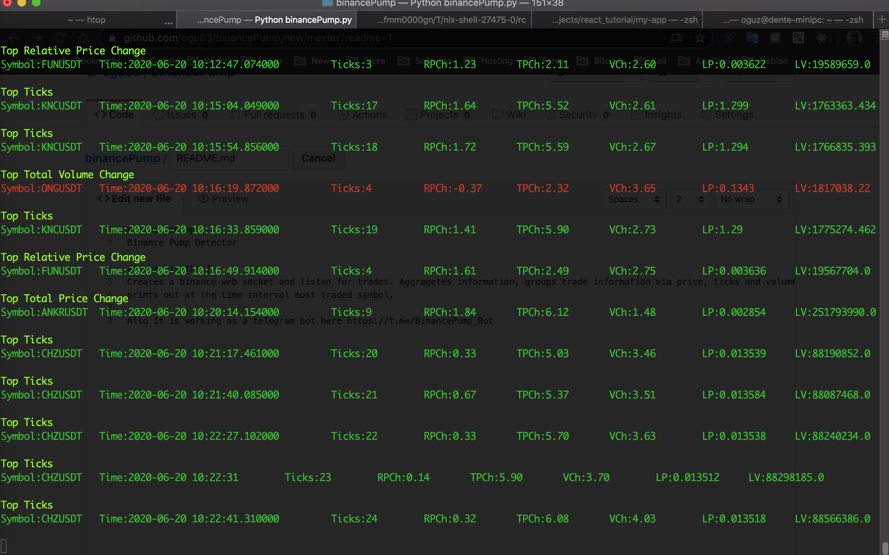

<p>
<a href="https://github.com/pre-commit/pre-commit"></a>
<a href="https://github.com/psf/black"></a>
</p>

# Binance Pump Detector

Tool that monitor trades on Binance to detect pump and dump events and display them in colors in the console.

E.g. roughly, when there is rapid increase in price and volume, it is considered as a pump event. Information about symbol name change in price and volume is displayed in console.


## How it works?
Creates a binance web socket and listen for trades. Aggregates information, groups trade information via price, ticks and volume.
prints out at the time interval most traded, price changed and volume changed symbol.
This information could be detected an anomaly. An anomaly in binance could be leading to pump or dump.

## How to run?

```bash
$ git clone https://github.com/ogu83/binancePump.git
$ pip3 install -r requirements.txt
```
Requires api credentials for binance client. Before running, create own `api_config.json` and fill with keys and secret (remember not to put these secrets into public repository).

Finally, run the detector:
```bash
$ python3 binancePump.py
```

## Screen Shot



## Credits
This project is a fork of [ogu83/binancePump](https://github.com/ogu83/binancePump). Credits to original author: [ogu83](https://github.com/ogu83).

## See also:
https://python-binance.readthedocs.io/en/latest/websockets.html
[How to code a Binance Trading bot that detects the most volatile coins on Binance](https://www.cryptomaton.org/2021/05/08/how-to-code-a-binance-trading-bot-that-detects-the-most-volatile-coins-on-binance/)

[MOMENTUM TRADING, RETURN CHASING, AND PREDICTABLE CRASHES]
(https://www.nber.org/system/files/working_papers/w20660/w20660.pdf)
https://github.com/cac90909/5.13-Trading-Automation
